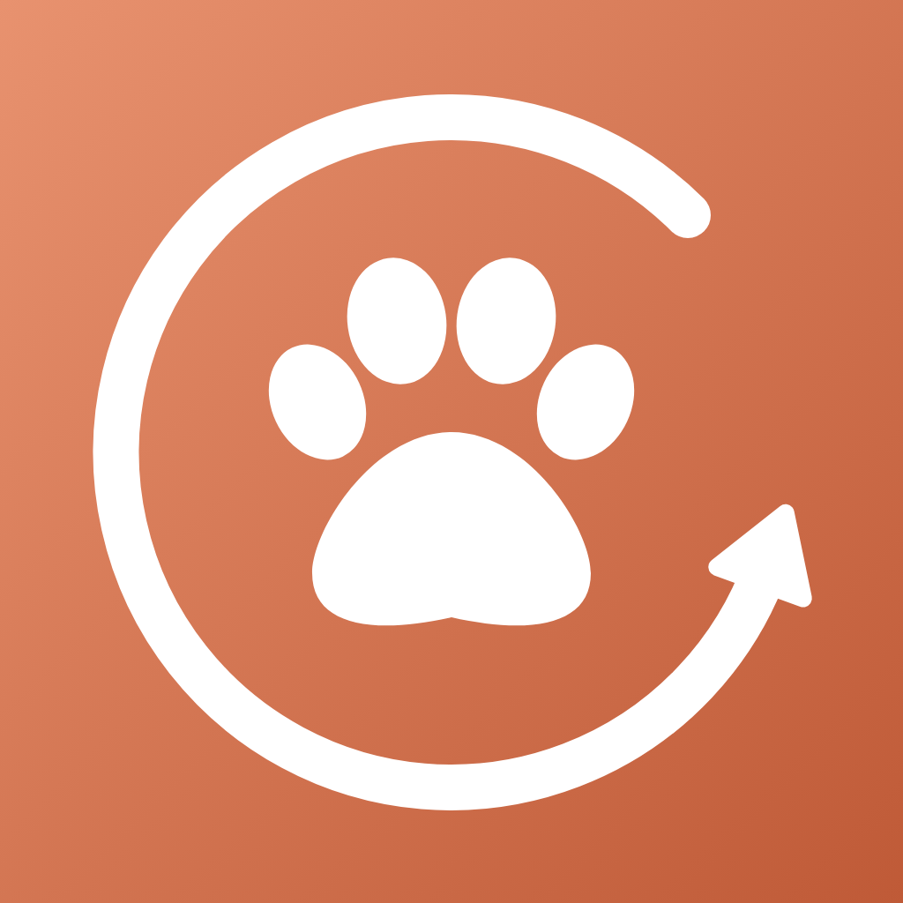
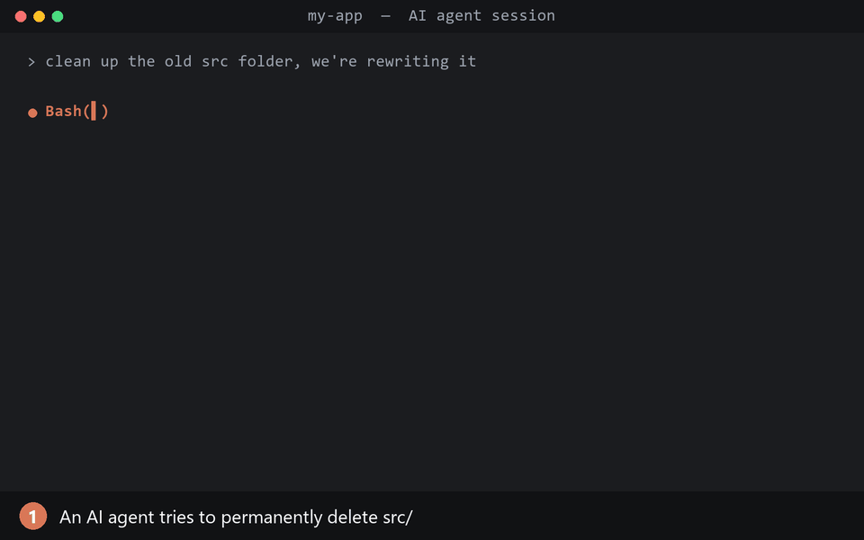

<p align="center"></p>

# Backpaw

**Get back what your AI coding agent deleted or moved.**

[](https://github.com/Ls1more/backpaw/actions/workflows/test.yml)

> **Use at your own risk.** Backpaw reduces the damage from accidental or prompt-injected deletes. It is
> not a backup and cannot catch every way a program can delete files. Keep real backups (OneDrive, File
> History, Time Machine). Provided as-is under the [MIT License](LICENSE), with no warranty.

<p align="center"></p>

AI agents run shell commands. When one runs `rm -rf`, `Remove-Item` or `mv` on the wrong thing, the agent's
own undo (like Claude Code's `/rewind`) can't help: shell side effects are outside checkpoint tracking.
Backpaw covers that gap for every major agent:

| Agent | Hook used | Config Backpaw writes |
|---|---|---|
| Claude Code | `PreToolUse` + `SessionStart` | `~/.claude/settings.json` |
| OpenAI Codex | `PreToolUse` + `SessionStart` | `~/.codex/hooks.json` |
| Gemini CLI | `BeforeTool` + `SessionStart` | `~/.gemini/settings.json` |
| Cursor | `beforeShellExecution` | `~/.cursor/hooks.json` |
| GitHub Copilot CLI | `preToolUse` | `~/.copilot/hooks/backpaw.json` |
| Windsurf | `pre_run_command` | `~/.codeium/windsurf/hooks.json` |
| Qwen Code | `PreToolUse` | `~/.qwen/settings.json` |
| Kimi Code CLI | `PreToolUse` | `~/.kimi-code/config.toml` (marked block) |
| OpenCode | `tool.execute.before` plugin | `~/.config/opencode/plugins/backpaw.js` |

Backpaw guards the **agent app**, not the model, so open-weight models (Kimi K2, Qwen3-Coder, DeepSeek,
GLM, gpt-oss, local models via Ollama/LM Studio) are covered whenever they run inside one of these apps,
including Claude Code pointed at an Anthropic-compatible endpoint.

What it does:

- **Guard**: blocks shell deletes and tells the agent to use `backpaw trash` instead, which sends files to
  the real **Recycle Bin** (Windows) or **Trash** (macOS). Also blocks other ways to lose work: emptying the
  Recycle Bin, `git clean`, `git reset --hard`, `git checkout --` / `git restore` / `git stash drop`,
  `rsync --delete`, `robocopy /MIR`, and moves or copies that would overwrite an existing file.
  Deletes inside the system temp folder (agent scratch space), build-output folders (`node_modules`, `dist`,
  `build`, `.venv`, `__pycache__`, ... editable under **Settings**) and commands run over `ssh` are allowed.
- **Ask first for things a Recycle Bin can't catch**: destructive cloud, API and database commands
  (`aws s3 rm`, `terraform destroy`, `kubectl delete`, `gh repo delete`, `git push --force`,
  `curl -X DELETE`, `DROP TABLE`, `DELETE FROM` without `WHERE`, `FLUSHALL`, ...) and MCP tools whose names
  say they delete data (`mcp__github__delete_repository`). Claude Code, Cursor and Copilot CLI show you a
  confirmation prompt; agents without one are blocked and told to ask you. Can be turned off in **Settings**.
- **Move log**: every `mv` / `Move-Item` is recorded so it can be undone. A move that would overwrite an
  existing file is blocked until that file is trashed.
- **Restore window**: select rows, click **Restore**. Turn the guard on or off per agent. Follows the
  system light/dark theme.
- **Session history**: lists deletes and moves from past Claude Code sessions (`~/.claude/projects`).
- **Backup check**: warns at session start (Claude Code, Codex, Gemini CLI) and in the window when work
  isn't backed up. For **git projects**, pushing is the backup: Backpaw reminds you if the repo has no remote,
  has commits not pushed for 3+ days, or has uncommitted changes on top of a 3+ day old commit
  (the number of days is adjustable under **Settings**). Other
  folders are checked for OneDrive (Windows) or iCloud / Time Machine (macOS). OneDrive isn't suggested for
  git repos, since syncing a `.git` folder can corrupt it. Includes a shortcut to Windows System Protection.

Pure Python standard library, no dependencies. Tested on Windows and macOS with Python 3.11 and 3.13.

## Install

Needs **Python 3.11+** ([python.org](https://www.python.org/downloads/), or on Windows
`winget install Python.Python.3.13`) and git.

```bash
git clone https://github.com/Ls1more/backpaw
cd backpaw
python backpaw.py install            # guard every agent found on this machine (configs are backed up first)
python backpaw.py install cursor     # or pick agents
python backpaw.py uninstall          # remove it everywhere
```

Restart the agent after installing. You can also turn the guard on or off per agent from the window
(**Agents…**).

## Use

```bash
python backpaw.py              # restore window (on Windows, pythonw backpaw.py opens it without a console)
python backpaw.py agents       # which agents are found / guarded
python backpaw.py trash FILE   # recycle a file (what agents are told to run)
python backpaw.py list         # log of trashed/moved items
python backpaw.py scan         # deletes/moves from past Claude Code sessions
python backpaw.py check [DIR]  # backup warning for a folder
python backpaw.py --version
python test_backpaw.py         # smoke test
```

The log lives in `~/.backpaw/log.jsonl`. `install` copies Backpaw to `~/.backpaw/backpaw.py` and points
the hooks there; after pulling a new version, run `install` again.

## Settings

Open **Settings** in the window. Saved in `~/.backpaw/settings.json` and used by both the window and the hooks.

| Setting | Default | What it does |
|---|---|---|
| Git reminder after | 3 days | How old unpushed commits or uncommitted changes get before you're reminded (1–30 days). |
| Folders deleted directly | `node_modules`, `dist`, `build`, `.venv`, `venv`, `__pycache__`, `.next`, `target`, `.pytest_cache`, `.cache` | Build output and caches that skip the Recycle Bin. Deletes here are **permanent**. Plain folder names only; matched on the folder being deleted or one inside the project on the way to it, never a parent above it, and links are judged by where they really point. |

| Ask before destructive cloud / API / database commands | On | Confirmation (or a block telling the agent to ask) for the commands and MCP tools listed above. |

The "Not backed up" banner can be collapsed with **Hide**; that choice is remembered too.

## Security model

Backpaw is a **seatbelt, not a sandbox**. It stops common accidental and injected deletes; it does not
contain an agent that is actively trying to escape. Hooks run with your user rights, outside any agent
sandbox, so Backpaw is built not to hand an agent anything it couldn't already do:

- **Restore can't be hijacked.** Moves are logged only if the source exists, with its file ID. Restore
  refuses any entry whose file ID doesn't match, any "trashed" item that isn't really in the Recycle
  Bin/Trash, and (on Windows) any item whose Recycle Bin record names a different original path. Refused
  entries show as `suspicious`.
- **Sensitive destinations get a second warning**: Startup, shell profiles, `.ssh`, `.git/hooks`, launch
  agents, and agent config folders.
- **The hook runs a private copy** in `~/.backpaw`, not the clone, so an agent working in the folder where you
  cloned Backpaw can't edit the code that runs on every command.
- **Agents can't turn it off**: `backpaw uninstall` run by an agent is blocked.
- **Wrappers are unwrapped**: `bash -c`, `powershell -Command`, `xargs`, `env`, `sudo`, `cmd /c`.
  PowerShell `-EncodedCommand` is blocked outright since its contents can't be checked.
- **No injection paths**: no shell is ever built from command text; the macOS Trash call passes the path as
  an argument. No third-party dependencies. Agent configs are written atomically and the pre-Backpaw
  original is kept as `*.backpaw-bak`.
- The log stores paths only, never command text.

Known gaps (by design or not yet covered):

- A script file run by the agent (`python cleanup.py`, `bash nuke.sh`) can delete anything; Backpaw only
  sees the command line.
- Shell redirection (`> file`) can truncate a file.
- If Python is missing or the hook crashes, most agents let the command through (Copilot CLI blocks it).
- An agent with unrestricted file access could edit its own hook config with its file-edit tool; only the
  shell route is blocked. Sandboxed agents can't reach those files.
- False positives: a command whose *text* contains delete-like code (for example a heredoc with
  `os.rmdir(...)` in it) is blocked too, since Backpaw can't tell data from code. The agent can write the
  file with its file-edit tool instead.

## Limits

- Detection is pattern-based. It catches common delete verbs, `find -delete`, and inline
  `shutil.rmtree` / `os.remove` / `fs.rm`, but a determined script can still delete files another way.
  Keep a real backup (OneDrive / File History / Time Machine).
- Once the Recycle Bin is emptied, a trashed item shows as `missing`.
- On a drive with no Recycle Bin (e.g. network shares), Backpaw refuses to delete rather than delete permanently.
- A command starting with `ssh` is treated as remote in full, so `ssh host x; rm local` is not caught.
- Agent support beyond Claude Code is built from each agent's published hook docs and tested with simulated
  payloads; please report anything that misbehaves. Gemini CLI hooks may need enabling in its settings.
- Not yet supported: Cline and Kilo Code (no shell-command hooks), Aider (no hook system), Crush and Goose
  (hook support not confirmed in upstream docs).
- macOS: the first `trash` asks for permission to control Finder (System Settings → Privacy → Automation).

## Privacy

Backpaw makes **no network connections** and collects nothing. Everything stays on your machine: the log
(`~/.backpaw/log.jsonl`, file paths only), your settings (`~/.backpaw/settings.json`), and the hook entries
it adds to your agents' config files.
The only link it opens is this repository, when you click it in the About box.

## Reporting security issues

See [SECURITY.md](SECURITY.md). Please report privately rather than in a public issue.

## License and trademarks

[MIT](LICENSE) © 2026 Ls1more.

Backpaw is an independent project and is **not affiliated with, endorsed by, or sponsored by** Anthropic,
OpenAI, Google, Anysphere (Cursor), GitHub/Microsoft, Windsurf/Cognition, Alibaba (Qwen), Moonshot AI
(Kimi), or the OpenCode project. Product names are used only to describe compatibility and belong to
their owners.
